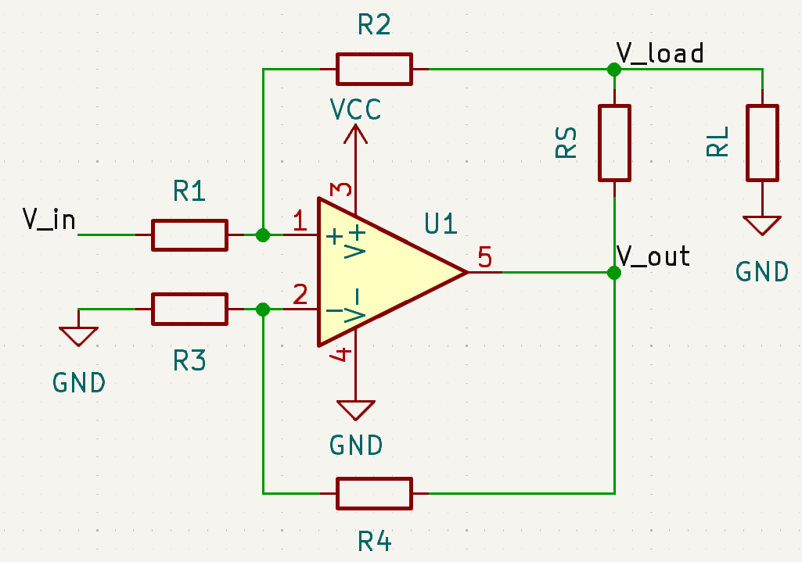

# The Improved Howland Current Pump

The "Improved" Howland Current Pump is a type of current pump capable of injecting current:
- in either direction (source or sink)
- to a grounded load

Texas Instruments has a great [application report](https://www.ti.com/lit/an/snoa474a/snoa474a.pdf?ts=1734576485321&ref_url=https%253A%252F%252Fwww.google.com%252F) covering the dynamics of the system, choice of of passive of components as well as the basic history of the circuit. 

As a supplement to their article, we will be deriving the relationship between $I_L$ and $V_in$.

# Analysis 

