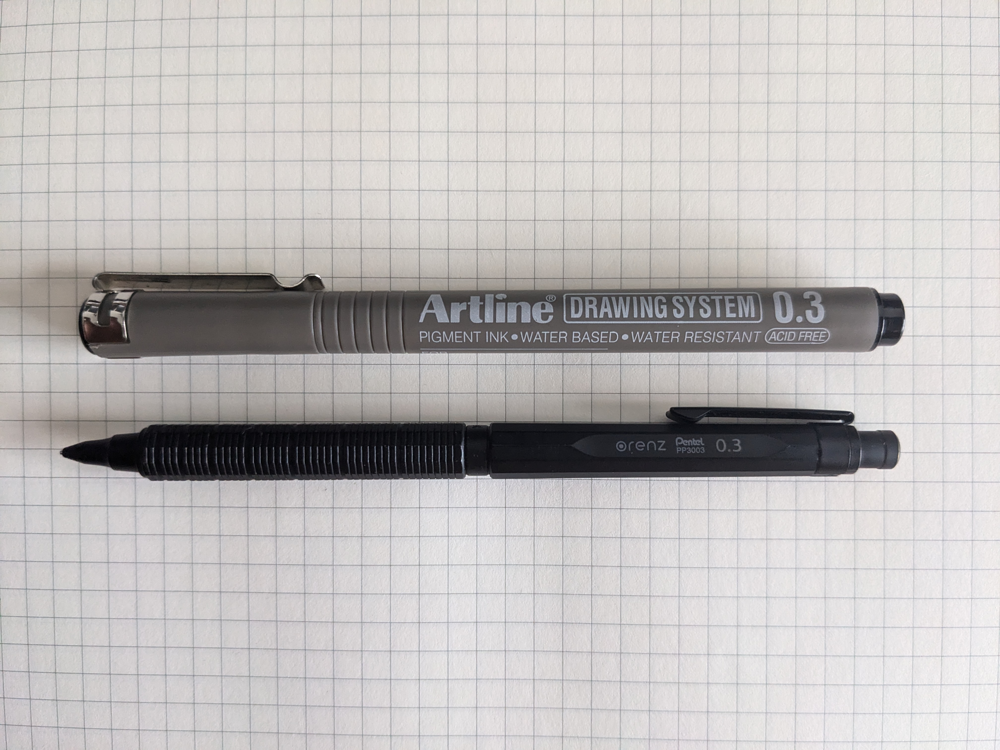

# Write to think
Notes, or writing, is a great way to store and share information. We take notes for a variety of reasons: meeting minutes, daily tasks, lectures,  etc. But a common cross roads met by to be note takers is to take notes digitally or physically. As one who has walked down this path, I would like to offer my two cents: do both! You will never know what works for you till you actually put it into practice. 

I did the same; for the entirety of undergraduate I took notes using paper, tablet and keyboard, with a variety of apps and cloud storage solutions (and pens). At the end of the 4 years, I still do both, with each method having its own unique place in my system.

# Fast and easy digital notes 
When it comes to digital apps, I've tried the following(with some rough ordering): 

1. Goodnotes 
2. Notion
3. Samsung Notes 
4. Flexil
5. Logseq
6. Obsidian 

In the end, none survived the day to day writing experience. Hand written digital notes (1, 3 and 4) were cumbersome to refer to outside of the app due to proprietary file formats, and I felt like I was spending more time scrolling through the screen than actually writing. Obsidian was the longest survivor, helping me evolve my digital notes into what it is today; jotting down my thoughts researching a topic, reading documentation or online meeting minutes. Eventually, I started to feel some friction with using Obsidian; as someone who only keeps the apps they are using up, Obsidian's start-up experience was a bit too slow, even with the command palette. 

> Disclaimer: Obsidian is still my go to recommendation for people looking to start taking notes. It just works! 

All I really needed for a note was: 
- a name for the file 
- a consistent location to store the notes
- the content itself

Hence, I decided to whip up a simple script to help with it; A fully guided note taking experience. I currently take my notes using my computers default code editor, but you could replace it with anything you want. 

Aptly named "Noter": 

```bash
note_store="/path/to/notes/folder/"

display() {
    filename=$(basename -- "$1")
    echo -e "\x1b[43m\x1b[30m$filename\x1b[0m"
    echo

    sed -e 's|^# \(.*\)|\x1b[31m[\1]\x1b[0m|' \
        -e 's|^## \(.*\)|\x1b[32m[\1]\x1b[0m|' \
        -e 's|^### \(.*\)|\x1b[33m[\1]\x1b[0m|' \
        -e 's|^#### \(.*\)|\x1b[34m[\1]\x1b[0m|' \
        -e 's|^- \(.*\)|* \1|' \
        -e 's|^\( *\)- \(.*\)|\1. \2|' \
        -e 's|\*\*\([^\*\*]*\)\*\*|\x1b[1m\1\x1b[0m|g' \
        -e 's|\*\([^\*]*\)\*|\x1b[3m\1\x1b[0m|g' \
        -e 's|`\([^`]*\)`|[\1]|g' \
        $1
}

entry_mode() {
    printf "note name: "
    read name

    path="$note_store$name"".md"
    $EDITOR "$path"

    display "$path"
}

view_mode() {
    selected_file=$(find $note_store -type f| fzf +m)

    display "$selected_file"
}

edit_mode() {
    selected_file=$(find $note_store -type f| fzf +m)

    $EDITOR "$selected_file"

    display "$selected_file"
}

del_mode() {
    selected_file=$(find $note_store -type f| fzf +m)

    printf "Delete $selected_file?[y/n] "
    read input

    case $input in
        "y")
            rm "$selected_file" ;;
        "Y")
            rm "$selected_file" ;;
        "n")
            echo "Cancelled..." ;;
        "N")
            echo "Cancelled..." ;;
    esac
}

modes="new\nview\nedit\ndelete"
selected_mode=$(printf "$modes" | fzf +m)

case $selected_mode in
    "new")
        entry_mode ;;
    "view")
        view_mode ;;
    "edit")
        edit_mode ;;
    "delete")
        del_mode ;;
esac
```

It's only dependency is [fzf](https://github.com/junegunn/fzf) and can easily be adapted to work without it. I even have some basic markdown "rendering" directly in the terminal with some semi-cursed regex(have a look at the display() function above). There's a number of things its missing, like a nice wrapper over grep for search, but so far I haven't needed to search for any notes beyond the file name. 

I also made some minor tweaks to my Neovim (code editor) configuration to make it a tad nicer to use when taking notes: 

```lua
vim.api.nvim_create_autocmd("FileType", {
    pattern = "markdown",
    callback = function()
        local opt = vim.opt_local

        opt.textwidth = 0
        opt.wrapmargin = 0
        opt.wrap = true
        opt.linebreak = true

        opt.spell = true
        opt.spelllang = "en_gb"

        opt.cursorline = true
        opt.cursorlineopt = "line"

        local highlight_comment = vim.api.nvim_get_hl(0, { name = 'Comment' })
        local highlight_normal = vim.api.nvim_get_hl(0, { name = 'Normal' })

        vim.api.nvim_set_hl(0, 'Normal', vim.tbl_extend('force', highlight_comment, { bg = '#000000' }))
        vim.api.nvim_set_hl(0, 'CursorLine', vim.tbl_extend('force', highlight_normal, { bg = '#000000' }))
        vim.api.nvim_set_hl(0, 'Visual', vim.tbl_extend('force', highlight_normal, { bg = '#000000' }))
    end
})
```

For syncing my notes between my different devices, I've opted to use [Syncthing](https://syncthing.net/). After trying out Google Drive, Outlook and even Nextcloud, I find all I needed was my files on the respective devices, not a way for me to remotely access them from the web.

# The pen is mightier than the keyboard(?)
A hidden benefit of writing , is its ability to help you think through a problem. This practice is often referred to as journaling, but I find that the concept generalises well to deep technical work and studying, providing you an avenue to work through a problem one step at a time. When it comes to this, I find no app or digital method beats plain pens and paper.

I believe it boils down to 2 simple reasons: 
1. its easier to refer to the current context of what you've written as you're writing it 
2. you can scribble

I believe the first point is self-explanatory, so let me dwell on the second. I classify scribbling in my writing as: boxing up random words, underlining things way too many times, drawing arrows between points and so on. Although to a third-party it may seem like the work of a madman, there is method to the madness. These "impromptu" breaks between prose help formulate my thoughts, giving it time to brew and connect together. An analogy I would use to this describe this would be the artistic concept of negative space, where the subject of the art piece takes shape from the boundaries around it. 

I've tried to emulate this same process in digital note taking, but have been unsuccessful thus far. Of course, this means giving up the biggest benefits of digital notes, portability and search. Although I'm not a fan, there are ways to "solve" this, such as books which make it easy to OCR and upload your notes. Apps on tablets are also an option, but as mentioned previously, I found them cumbersome to use and refer to without zooming and panning everywhere.

My writing kit (with some thick grid paper):


# Takeaways
1. Stick with portable note formats for digital notes where you can: it'll save you a lot of headache if you ever want to switch
2. Use things you enjoy: we have way too many options for apps (as well as pen and paper), to be stuck on any
